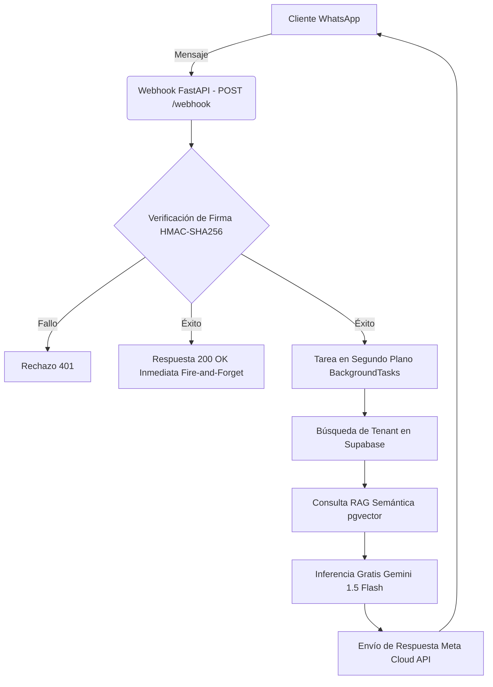

# KIVI


-000000?logo=next.js&logoColor=white)


KIVI es una plataforma distribuida B2B SaaS multitenant para la automatización de atención al cliente en WhatsApp mediante Inteligencia Artificial y RAG (Retrieval-Augmented Generation).

---

## Arquitectura y Flujo de Datos

El backend de KIVI sigue un patrón **Modular Monolith** con un enfoque **Hexagonal Lite (Ports & Adapters)**. Este diseño permite desacoplar la lógica de dominio central de los proveedores de infraestructura externos. Esto facilita, por ejemplo, cambiar el proveedor de IA (como nuestra migración transparente de OpenAI a Gemini) de forma limpia y mantenible.

### Ciclo de Vida del Mensaje

El siguiente diagrama ilustra el ciclo de vida asíncrono y distribuido de un mensaje:



---

## Estructura del Modelo de Datos (Multitenancy)

La persistencia relacional y vectorial distribuida de KIVI se estructura en 4 tablas esenciales alojadas en Supabase:

1. **tenants**: Tabla maestra que registra a los negocios inquilinos de la plataforma, guardando sus identificadores de negocio y tokens de WhatsApp de manera segregada.
2. **knowledge_base**: Base de conocimientos vectorial del sistema RAG. Contiene los fragmentos de texto procesados y sus embeddings, definidos bajo el tipo `VECTOR(768)` para almacenar la salida directa del modelo `text-embedding-004` de Gemini.
3. **conversations**: Mantiene el registro y estado de las conversaciones activas, vinculando un negocio (`tenant_id`) con el número telefónico de su respectivo cliente.
4. **messages**: Tabla que persiste el historial completo y cronológico de los mensajes dentro de una conversación, dándole memoria contextual histórica a las inferencias de la IA.

---

## Guía de Inicialización Local

Sigue estos pasos para levantar el entorno de desarrollo localmente.

### Prerrequisitos
- Python 3.12+
- Node.js 20+
- Docker Desktop
- Git

### 1. Clonar el repositorio

```bash
git clone https://github.com/sekai882/kivi.git
cd kivi
```

### 2. Infraestructura Compartida

Levanta los contenedores base (como Redis) mediante Docker Compose:

```bash
docker-compose up -d
```

### 3. Backend (FastAPI)

```bash
cd backend

# Crear el entorno virtual
python -m venv .venv

# Activar el entorno virtual
# En Windows:
.venv\Scripts\activate
# En Linux/macOS:
source .venv/bin/activate

# Instalar dependencias
pip install -r requirements.txt

# Levantar el servidor Uvicorn en el puerto 8000
uvicorn src.main:app --reload --port 8000
```

### 4. Frontend (Next.js)

En una nueva terminal de tu entorno de trabajo:

```bash
cd frontend

# Instalar los paquetes y dependencias de Node
npm install

# Iniciar servidor de desarrollo en el puerto 3000
npm run dev
```

---

## Variables de Entorno

Copia el archivo `.env.example` como `.env` dentro de la carpeta `backend/` y configura las siguientes variables:

| Variable | Descripción |
|----------|-------------|
| `DATABASE_URL` | String de conexión a Supabase (Pooler/Transaccional) para manejar conexiones escalables. |
| `DIRECT_URL` | String de conexión directa a Supabase (usada para migraciones de BD). |
| `META_VERIFY_TOKEN` | Token secreto utilizado para que Meta verifique tu endpoint de Webhook. |
| `META_APP_SECRET` | Secreto de la aplicación en Meta, usado para validar la firma de los payloads. |
| `META_PHONE_NUMBER_ID` | Identificador del número de teléfono en Meta Cloud API. |
| `META_WHATSAPP_TOKEN` | Token de acceso de la API de Meta para el envío de mensajes. |
| `GEMINI_API_KEY` | Clave de acceso a la API de Gemini (Google AI Studio) para los modelos de inferencia y embeddings. |
